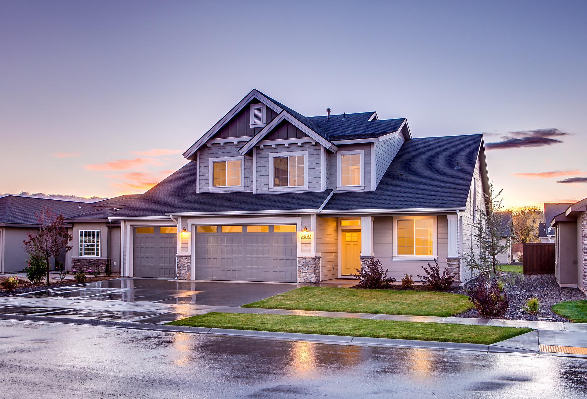

# Phase-Two-Project-Repository

# Overview
This project analyzes the aspects of houses in order to reccommend renovations for a real estate office. Descriptive analysis of various aspects of house, such as how many sqft it is, how many floors, and how many bathrooms were used in a linear regression inferential anaylsis to find the highest correlation between the features. Our recommendation for the real estate office in renovating properties is to possibly expand the sqft of homes, including adding more bathrooms and bedrooms. 

# Business Problem

The local real estate company wants to know what renovations improve the house prices in their area. Inferential statistics of the data provided are depicted in order to aid the the real estate office in understanding the market value in local house renovations in comparison to others in order to recommend profitable renovations to their clients. 

# Data Understanding

The data provided is csv file of many different aspects of homes in the area such as how many floors, bathrooms, bedrooms they contain. And also when they were built, renovated, and other aspects such as having a waterfront or a view. 

The highest correlation with price of the houses was sqft feet of the houses. It correlated about 70% with the raw data before modeling for linear regression. 

# Modeling
A baseline model with sqft_living as the most correlated feature was initially created and had similar train and validation scores:
Train score: 0.4514748794103558 Validation score: 0.45954078182078667

A second model was created with streamlining of the features and removing those which had low correlation and little relation: "id", "floors", "yr_renovated". It yielded the highest R-square value and a statistically significant F-statistic. 

A third model was created by singling out two of the significant features: "sqft_living", "bedrooms" however it did not improve the train and test scores:
Train score:      0.48252682901928745
Validation score: 0.49167533524710335

A dummies model including the dummy variables made of the categorical variables Waterfront and View, along with sqft_living onto price was created but had a similar r-squared value of .495 with a non-statistical significant F-statistic. 

    OLS Regression Results                            
==============================================================================
Dep. Variable:                  price   R-squared:                       0.495
Model:                            OLS   Adj. R-squared:                  0.495
Method:                 Least Squares   F-statistic:                     2627.
Date:                Wed, 22 Jun 2022   Prob (F-statistic):               0.00
Time:                        11:25:26   Log-Likelihood:            -2.5611e+05
No. Observations:               18783   AIC:                         5.122e+05
Df Residuals:                   18775   BIC:                         5.123e+05
Df Model:                           7                                         
Covariance Type:            nonrobust                                         

# Regression Results 

The best model, consisting of sqft_living, bedrooms, bathrooms, sqft_lot, sqft_above, sqft_living15 onto price, accounts for about 60% of the variance as shown below in the OLS Regression results consisting of the R-square = .609 and p-values. 

    OLS Regression Results                            
==============================================================================
Dep. Variable:                  price   R-squared:                       0.609
Model:                            OLS   Adj. R-squared:                  0.609
Method:                 Least Squares   F-statistic:                     3248.
Date:                Wed, 22 Jun 2022   Prob (F-statistic):               0.00
Time:                        11:24:05   Log-Likelihood:            -2.5370e+05
No. Observations:               18783   AIC:                         5.074e+05
Df Residuals:                   18773   BIC:                         5.075e+05
Df Model:                           9                                         
Covariance Type:            nonrobust                                         

 # Issues of multicollinearity within the models
There is also an issue of multicollinearity that became apparent. 
The predicted price shown below is not perfect but aligns well.

The Q-Q Plot below shows that we are not violating this assumption.

High homoscedasticity (Goldfeld-Quandt test) was recorded as well as depicted in the 'funnel' shape below.

# Conclusions
I would advise the local real estate office that renovations for more sqft of space within the house and additions of bathrooms and bedrooms could gain more of a profit than other poetential renovations. 

# Next Steps
Perhaps collecting a wider pool of data would add in adding variance and leading to a stronger correlation between the values as well as looking into other aspects of what renovations entell, such as the expense for particular jobs, trends in home making magazines and many other aspects that could lead to different renovation reccommendations for the most profit in resell. 

# For More Information
See the full analysis in the [Jupyter Notebook](https://github.com/rabrya0072/Phase-Two-Project-Repository/blob/main/Real%20estate%20Resale%20Needs%20Analysis.ipynb) or [presentation](https://github.com/rabrya0072/Phase-Two-Project-Repository/blob/main/Phase%202%20Project%20presentation%20(1).pdf) in this repository.

For additional info, contact Rachael Bryant at Rachaelbryant@flatironschool.com
# Repository Structure
├── code
│   ├── __init__.py
│   ├── data_preparation.py
│   ├── visualizations.py
├── data
├── images
├── README.md
├── Real estate Resale Needs Analysis.pdf
└── Real estate Resale Needs Analysis.ipynb

